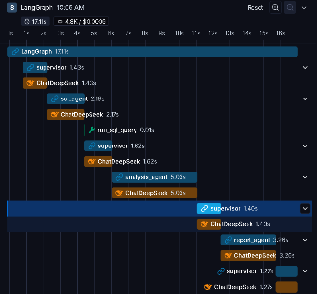

# Phase 5 — Observability & Guardrails

Goal: make the Phase 4 crew robust and inspectable, not just functionally correct. Two things drove this phase: nothing was stopping the Supervisor from looping forever if it kept deciding "not done yet," and I'd been generating LangSmith traces since Phase 1 without ever actually digging into one properly.

## What's in this folder

| File | What it demonstrates |
|---|---|
| `multi_agent_crew.py` | Phase 4's crew hardened with an iteration cap, a recursion-limit backstop, and a generic retry wrapper applied to every node |
| `images/waterfall_trace.png` | LangSmith's node-by-node timing/cost breakdown for a real run — see below |

## Key concepts

**Two independent guardrails against infinite loops, not one.** A soft cap I control (`MAX_ITERATIONS = 6`, tracked in state, forces a clean `FINISH`) plus LangGraph's own hard backstop (`recursion_limit` in config, raises `GraphRecursionError`). Defense in depth: if my own counter has a bug, the second layer still catches it — just less gracefully.
```python
class CrewState(TypedDict):
    messages: Annotated[list, add_messages]
    next: str
    iterations: int

MAX_ITERATIONS = 6

def supervisor_node(state: CrewState) -> dict:
    iterations = state.get("iterations", 0) + 1
    if iterations > MAX_ITERATIONS:
        return {"next": "FINISH", "iterations": iterations}
    ...
```
```python
config = {
    "configurable": {"thread_id": "crew-session-1"},
    "recursion_limit": 15,
}
```

**A generic retry wrapper, applied everywhere — not just where a bug happened to surface.** Phase 4 only wrapped the Supervisor's LLM call in retry logic, because that's the node that happened to break first. Phase 5 generalized it to every node, since any of them could hit a transient API error (network blip, rate limit) in practice, not just the one that got unlucky during development:
```python
def invoke_with_retry(chain_or_llm, inputs, max_attempts=3, node_name="node"):
    for attempt in range(1, max_attempts + 1):
        try:
            return chain_or_llm.invoke(inputs)
        except Exception as e:
            print(f"[{node_name}] call failed (attempt {attempt}/{max_attempts}): {e}")
            time.sleep(2 ** (attempt - 1))  # 1s, 2s, 4s
    raise last_error
```

**Observability isn't just "having traces" — it's actually reading them.** I'd had LangSmith tracing turned on since Phase 1, but this was the first phase where I deliberately went into a trace to verify a specific claim, rather than just glancing at the top-level pass/fail.

## What I verified in this phase

### 1. The guardrails don't false-trigger on a normal run
Ran the same Phase 4 question through the hardened crew:
> *"What were the top 5 genres by total sales, and is there anything unusual about the numbers?"*

Result: correct answer, no retries fired, no iteration cap hit, completed in **4 supervisor iterations** (route→sql_agent, route→analysis_agent, route→report_agent, final route→FINISH) — the expected minimum for this question shape.

### 2. Per-node cost and latency, from the actual trace
Pulled up the waterfall view in LangSmith for this run:



Total: **17.11s, 4.8K tokens, $0.0006** — genuinely cheap, which matters for a project meant to be iterated on freely. Per-node breakdown was more interesting than expected:
- `analysis_agent`: **5.03s** — the slowest single node, slower than the SQL round-trip
- `report_agent`: 3.26s
- `sql_agent`: 2.19s (query-writing + execution)
- Each `supervisor` routing call: ~1.3–1.6s

I'd assumed the SQL agent (two LLM round-trips: write the query, then read results) would be the bottleneck. It wasn't — the free-text reasoning steps (analysis, report) took longer than the tool-calling step. Worth remembering if optimizing for latency later: the "thinking" nodes cost more than the "doing" nodes here.

### 3. The Phase 4 sanitization fix, confirmed at the API level
This took a few wrong turns before landing on the right view, worth documenting since it's a real lesson in reading LangSmith traces correctly:

- First checked the **top-level run list** — only shows aggregate latency, not useful for verifying a specific node's behavior.
- Then checked a **node's Input/Output tab** (`supervisor`'s own view) — this shows the raw Python `state` dict the node function received, which is *always* unsanitized, since `build_supervisor_context()` only builds a local, sanitized copy for the LLM call itself. Seeing raw tool-call data here does **not** mean sanitization failed.
- The actual proof is one level deeper: the **nested `ChatDeepSeek` child span** under the `supervisor` node — that's the literal API request. Its Input tab showed `[agent used a tool: run_sql_query]` as plain text, with no raw `tool_calls` JSON anywhere, and its Output showed `route` called cleanly with `next_agent: analysis_agent`.

Full screenshot and explanation of this specific verification is in [`Phase4_MultiAgent/README.md`](../Phase4_MultiAgent/README.md), since the evidence belongs with the bug it proves, not with the phase where I happened to go looking for it.

**Takeaway:** a node's function-level Input/Output in LangSmith is not the same thing as the actual model call — if you're debugging what the LLM literally saw, go one level deeper to the child span, not the node itself.

## How to run

```bash
python multi_agent_crew.py
```
(Requires `chinook.db` from Phase 2 at `../Phase2_Tools/chinook.db`. Reuses the same LangSmith project as prior phases — check the `statefulcrew` project dashboard for traces.)

## Why this matters for Phase 6+

Phase 4's bugs were found by staring at print statements and stack traces — useful, but slow, and it only works when something crashes loudly. This phase's real lesson is that most of what you need to debug an agent system silently misbehaving (wrong routing, cross-contamination between agents, cost/latency surprises) is already sitting in your trace tool — you just have to know which level of the trace actually answers your question.