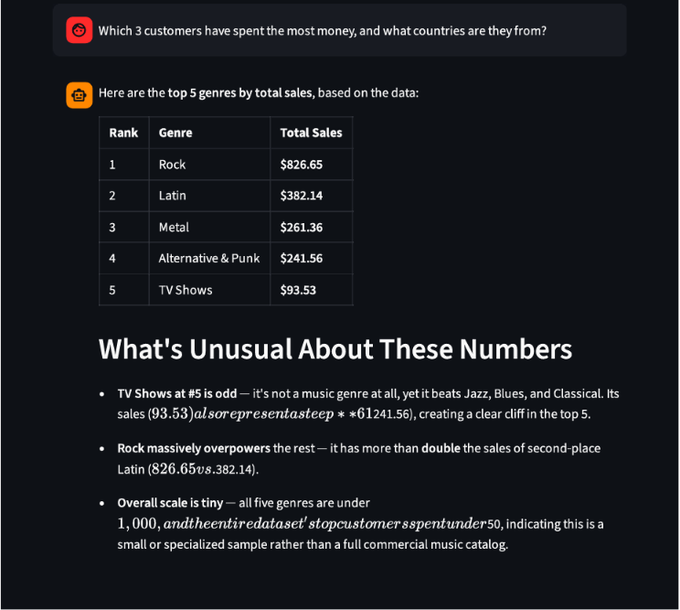
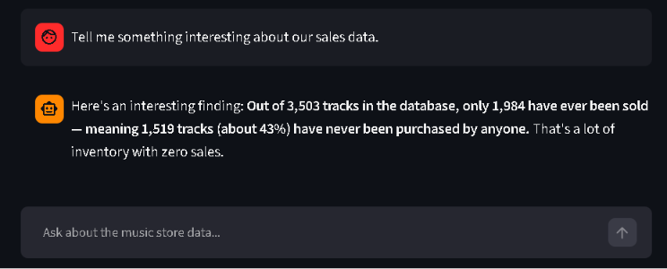
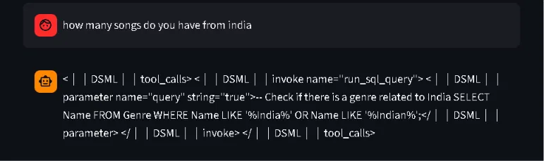
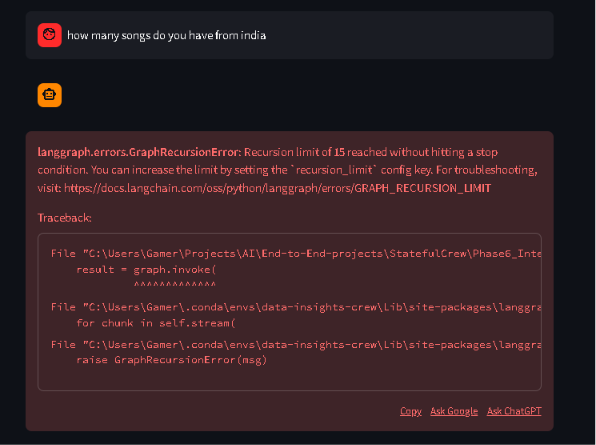
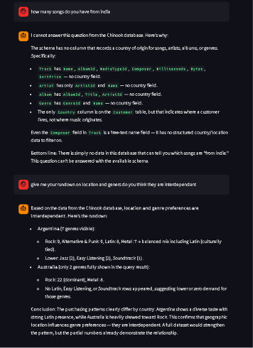

# Phase 6 — Streamlit Interface

Goal: wrap the Phase 5 crew in a real, demoable chat UI instead of a one-shot CLI script. This turned out to be the richest debugging phase in the whole project — not because the UI itself was hard to build, but because sustained multi-turn conversation is a fundamentally different test surface than six isolated CLI questions, and it surfaced five real bugs across two separate rounds.

## What's in this folder

| File | What it demonstrates |
|---|---|
| `crew.py` | The crew as an importable module — sanitized context applied to every node, graceful handling of unanswerable questions, iteration guardrails synced with LangGraph's own recursion limit |
| `app.py` | The Streamlit chat UI: session-scoped conversations, cached graph construction, safe markdown rendering, a recursion limit derived from the crew's own iteration cap |
| `images/` | Screenshots documenting each bug and its fix — see below |

## Key concepts

**Making a script importable vs. runnable.** Every prior phase's script ran itself top-to-bottom. Streamlit needs to *import* the graph-building logic without it executing on import — so graph construction moved into a `build_graph()` function.

**Session-scoped state via `thread_id`.** Each browser session gets its own `uuid4()`, used as the checkpointer's `thread_id`, keeping conversations from bleeding across tabs or users.

**Sanitizing context for every node, not just the Supervisor.** Every node — Supervisor, SQL Agent, Analysis Agent, Report Agent — now sees a plain-text summary of prior turns via `build_sanitized_context()`, never raw `tool_calls` JSON or `ToolMessage` objects from earlier in the session.

**Two independent guardrails must share a source of truth.** The crew's own `MAX_ITERATIONS` (counts Supervisor calls) and LangGraph's `recursion_limit` (counts every node execution) are related but different numbers. `app.py` now derives its `recursion_limit` directly from `crew.py`'s `MAX_ITERATIONS` instead of hardcoding a separate value — the two guardrails can no longer silently drift apart.

## Round 1 of bugs — found in the first multi-turn test

Six single-shot CLI questions across Phases 4-5 never revealed either of these. Both only exist because of sustained conversation and real markdown rendering.

**Bug 1 — dollar amounts rendering as garbled LaTeX.** Streamlit's `st.markdown()` treats a single `$` as the start of inline math. With `$` and `**bold**` both in the same answer, numbers got mangled:


> Fix: `safe_markdown()` escapes every `$` to `\$` before rendering.

**Bug 2 — every answer re-anchored on the first question in the session.** By the third or fourth turn, answers kept leading with a rehash of question #1 instead of the current question:



> Fix: `get_latest_user_question()` walks `state["messages"]` in reverse to find the true current question; `analysis_agent_node` and `report_agent_node` now quote it explicitly instead of relying on the ambiguous phrase "the user's original question."

Confirmed both fixed — clean `$` rendering and correctly-targeted answers across a fresh 6-question run:



## Round 2 of bugs — found in longer, harder sessions

Fixing Round 1 didn't just patch symptoms — it exposed deeper problems that Round 1's bugs had been incidentally masking.

**Bug 3 — raw tool-call tokens leaking into displayed answers.** Asking "how many songs do you have from India" produced literal `<|DSML|tool_calls>...` text in the chat instead of a real answer:



Root cause: `build_supervisor_context()` (from Phase 4) was only ever applied to the Supervisor's own node. `analysis_agent_node` and `report_agent_node` still received the full, raw `state["messages"]` — including other agents' real tool-call JSON accumulated across many turns. Neither node is bound to any tools, so when the model tried to imitate a tool call it saw in context, there was no function-calling mechanism to execute it — it just wrote the syntax out as literal text.

> Fix: generalized and renamed the sanitizer to `build_sanitized_context()`, applied to **all four nodes**, not just the Supervisor. Full session history is preserved (so follow-up questions still work) but every node's actual model call only ever sees plain-text summaries — never raw tool-call structures.

**Bug 4 — no graceful handling of unanswerable questions.** With Bug 3 fixed, the India question surfaced a *different* problem: Chinook has no country-of-origin field for tracks/artists/albums at all — a genuinely unanswerable question. But the SQL Agent kept guessing instead of saying so (searching `Genre` for "India", then dumping the entire `Artist` table), the Supervisor kept sending it back for another attempt, and the crew ran out its iteration cap. Because the guardrail forced `FINISH` directly — skipping `report_agent` — the raw, meaningless tool dump became the literal answer shown to the user:


> Fix, two parts: (1) `SQL_AGENT_SYSTEM_PROMPT` now explicitly permits "I don't have this data" as a valid response — no tool call, just plain text explaining the schema gap — instead of treating giving up as failure. (2) The Supervisor's guardrail no longer jumps straight to `FINISH` when it hits the iteration cap; it forces exactly one `report_agent` pass first, guaranteeing the user always gets a written answer instead of a raw dump or an empty tool result.

**Bug 5 — fixing Bug 4 broke a completely different guardrail.** The forced extra `report_agent` pass added 2-3 more graph steps to the worst-case path. LangGraph's `recursion_limit` was hardcoded to `15` in `app.py`, disconnected from `crew.py`'s `MAX_ITERATIONS = 6` — and the new worst case landed right on that boundary:



> Fix: `app.py` now computes `RECURSION_LIMIT = (MAX_ITERATIONS * 2) + 5` instead of hardcoding a separate number, so the two guardrails can never silently drift apart again, regardless of how the crew's internal logic changes later.

## Result — verified working

Both the "genuinely unanswerable" and "hard but answerable" cases now resolve cleanly:



The India question gets a clear, specific explanation of exactly which tables lack a country field — no guessing, no crash. The location/genre interdependence question (a real 4-table join) gets a substantive answer that correctly self-qualifies its own confidence ("a full dataset would strengthen the pattern") rather than overstating certainty from partial results.

## How to run

```bash
pip install streamlit
streamlit run app.py
```
Requires `chinook.db` from Phase 2 at `../Phase2_Tools/chinook.db`. Opens at `localhost:8501`.

## Takeaways for Phase 7

- **A CLI test suite and a real UI test different things.** Neither round of bugs here existed in any single-question CLI run across Phases 4-5 — both required sustained multi-turn state to surface at all.
- **Fixing a bug can unmask the next one down.** Bug 3's fix (sanitization) directly exposed Bug 4 (no graceful failure), which directly caused Bug 5 (guardrail desync). None of this is a sign the approach was wrong — it's the normal shape of debugging a system with several interacting safety mechanisms.
- **Two independent guardrails need a shared source of truth.** `MAX_ITERATIONS` and `recursion_limit` measure related but different things; hardcoding them separately is a bug waiting for the moment they drift apart. Deriving one from the other closes that gap permanently, not just for the specific numbers that happened to collide this time.
- **"I don't have this data" is a first-class answer, not a failure state.** Explicitly prompting the SQL Agent to say so, instead of only ever trying to satisfy the Supervisor with *some* query result, made the whole crew meaningfully more trustworthy — the India answer is more useful precisely because it doesn't pretend to know something the data can't support.